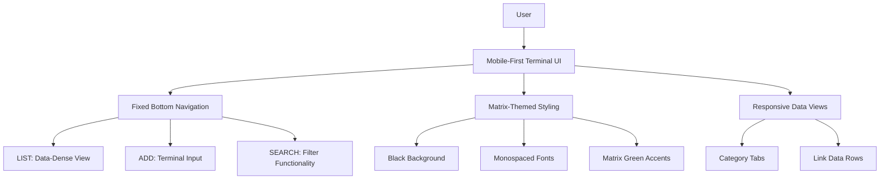

# Architectural and Visual Reset Plan

## Overview
This plan outlines the changes required to implement a full architectural and visual reset for the Digital Junk Draw application, transforming it into a high-speed terminal-like interface optimized for mobile devices.

## Current State Analysis
- The application uses Next.js with React Server Components
- Current styling uses Tailwind CSS with a light/dark theme system
- Navigation and data handling have some reliability issues
- The UI is not optimized for mobile-first experience

## Target Architecture

## Detailed Implementation Plan

### 1. Critical Fixes (Reliability)

#### Fix Redirect Issue
- **File**: `src/app/actions/links.ts`
- **Change**: Move `redirect('/')` outside the try/catch block in the `addLink` function
- **Reason**: Prevents 'NEXT_REDIRECT' error by ensuring redirect only happens after successful operation

#### Kill Ghosting
- **File**: `src/app/page.tsx`
- **Changes**:
  - Add `export const dynamic = 'force-dynamic'`
  - Add `export const revalidate = 0`
- **Reason**: Ensures fresh database pull on every page load, eliminating stale data

### 2. Responsive Matrix UI (Mobile-First)

#### Theme Overhaul
- **Files**: `src/app/globals.css`, `src/app/layout.tsx`
- **Changes**:
  - Set background to pure black (#000000)
  - Use monospaced fonts (Geist Mono)
  - Matrix Green (#00FF41) for text and accents
  - Remove light/dark theme switching for consistent terminal look

#### Mobile Fit
- **Files**: `src/app/layout.tsx`, `src/app/globals.css`
- **Changes**:
  - Ensure `max-width: 100vw` and `overflow-x: hidden`
  - Use `px-4` padding to prevent text from touching screen edges
  - Update safe area handling for mobile devices

#### Header Design
- **File**: `src/app/page.tsx`
- **Changes**:
  - Create slim header with blinking cursor effect
  - Text: `SYSTEM_LOG // JUNK_DRAW _`
  - Use monospaced font and Matrix Green color
  - Add subtle animation for cursor blinking

#### Category Tabs
- **File**: `src/app/page.tsx`
- **Changes**:
  - Implement horizontal scrolling category list
  - Use segmented control style with terminal button appearance
  - Style: `[ ALL ] [ WORK ] [ SOCIAL ]`
  - Ensure touch-friendly hit areas

### 3. The List View (Data-Dense)

#### Data Row Styling
- **File**: `src/app/page.tsx` (LinkCard component)
- **Changes**:
  - Thin green border-bottom for each link
  - Two-row layout:
    - Top row: TITLE (Bold, Green)
    - Bottom row: SOURCE (Dimmed green/Grey) | TIME (Dimmed)
  - Large hit-area for easy thumb-tapping
  - Remove card-style borders and shadows

### 4. The 'Add Link' Page (Terminal Input)

#### Command Prompt Styling
- **File**: `src/app/add/page.tsx`
- **Changes**:
  - Style inputs to look like command prompts: `INPUT_URL >` and `INPUT_TITLE >`
  - No borders, just glowing green bottom-border on focus
  - Use monospaced font for all text
  - Matrix Green color scheme

#### Mobile Keyboard Handling
- **File**: `src/app/add/page.tsx`
- **Changes**:
  - Ensure 'Add' button stays above keyboard
  - Make button large enough for easy tapping
  - Add proper viewport handling

### 5. Navigation

#### Bottom Tab Bar
- **File**: `src/app/page.tsx` and `src/app/add/page.tsx`
- **Changes**:
  - Fixed bottom-tab bar with LIST, ADD, and SEARCH icons
  - Use simple, sharp line icons
  - Ensure proper spacing and hit areas
  - Consistent styling across all pages

## Implementation Priority

1. **Critical Fixes** (Must be done first to ensure reliability)
2. **Theme and Layout** (Foundation for visual changes)
3. **Header and Navigation** (Core UI structure)
4. **List View** (Primary content display)
5. **Add Link Page** (Secondary but important workflow)

## Testing Considerations

- Verify redirect fix eliminates NEXT_REDIRECT errors
- Confirm dynamic data loading works on every page load
- Test responsive design on various mobile devices
- Ensure touch targets meet accessibility standards
- Validate color contrast for readability

## Performance Impact

- The `force-dynamic` setting may increase server load
- Consider implementing client-side caching for frequently accessed data
- Monitor database query performance with increased revalidation

## Accessibility

- Ensure sufficient color contrast between green text and black background
- Maintain proper touch target sizes (minimum 48x48px)
- Test with screen readers for proper semantic structure
- Verify keyboard navigation works correctly

## Next Steps

Review this plan with the team and get approval before proceeding with implementation. The plan addresses all requirements while maintaining the application's core functionality.